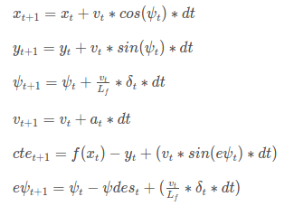

# **Project 5 Submission in CarND-Term2**
This repository contains project 5 submission in Self-Driving Car Nano-Degree, Term 2, Model Predictive Control. Modified source codes are all included in folder ./src. The following files are modified:

1. MPC.cpp
2. main.cpp

##### 1. MPC processing steps
a) from simulator, capture way points:  `ptsx` and `ptsy`, and vehicle state: `px`, `py`, `psi`, `v`, `delta`, and `a`.

b) convert way points coordinate from map perspective to vehicle perspective, and fit way points into a third order polynomial.

c) based on current vehicle state and fitted polynomial coefficients, and predefined cost function and model constraints, find an optimal trajectory and associated actuations, by utilizing the IPOPT and CPPAD libraries.

d) send the actuation commands, `steer_value` and `throttle_value` to simulator. Also send fitted polynomial and calculated optimal trajectory to simulator for illustration purpose.

e) go back  to step a) for the next step.

##### 2. Vehicle motion model and cost function

The vehicle motion model is adopted from the class notes and each state has 6 variables: `{x, y, psi, v, cte, epsi}`, as below:



The model constrains are developed based on the motion model. The cost function used is as follow:

`cost = a * cte^2 + b * epsi^2 + c * (v-ref_v)^2 + d * delta^2 + e * a^2 + f * (delta*v)^2 + g * delta_delta^2 + h * a_delta^2`

`a, b, c, d, e, f, g, h` are weighting factors. And `delta_delta` is the change rate of steering angle, and `a_delta` is the change rate of acceleration. These two are used to punish sudden change on steering angle and acceleration. The term `(v-ref_v)^2` is used to for the speed to close to reference speed (ref_v = 70) as much as possible, and prevent the vehicle stuck. The term `(delta*v)^2` is adopted from [this post](https://github.com/jeremy-shannon/CarND-MPC-Project/blob/master/README.md) to prevent large steering angle at high speed. I found that this term acted quite effectively and slowed down the vehicle whenever sharp turning is present and keep the vehicle staying on track. After quite a lot tunning, the weighting factors for various terms are as below:

```cpp
cte_cost_weight = 3000;
epsi_cost_weight = 3000;
v_cost_weight = 2;
delta_cost_weight = 5;
a_cost_weight = 5;
delta_v_cost_weight = 500;
delta_change_cost_weight = 200;
a_change_cost_weight = 10;
```
##### 3. Time steps and elapsed duration selection

The final time steps is set to `N = 10`, and elapsed duration per steps is set to `dt = 0.1`. The total duration for model prediction is `1 second`. I tried to set `N = 20` and `dt = 0.05`, but the vehicle suffers from more wiggling on the track.

##### 4. Latency treatment

When considering `100ms` auction latency, I set the initial state (model constraints) for IPOPT with the predicted state after 100ms instead of current state obtained from simulation. The prediction is statement is as below:

```cpp
// predict state after latency
double dt_latency = 0.1;
double pred_x = x + v * cos(psi) * dt_latency;
double pred_y = y + v * sin(psi) * dt_latency;
double pred_psi = psi + v * delta / Lf * dt_latency;
double pred_v = v + a * dt_latency;
double pred_cte = cte + v * sin(epsi) * dt_latency;
double pred_epsi = epsi + v * delta / Lf * dt_latency;
```
The initial state constraints are set below:

```cpp
// used the predicted state after latency as initial state
constraints_lowerbound[x_start] = pred_x;
constraints_lowerbound[y_start] = pred_y;
constraints_lowerbound[psi_start] = pred_psi;
constraints_lowerbound[v_start] = pred_v;
constraints_lowerbound[cte_start] = pred_cte;
constraints_lowerbound[epsi_start] = pred_epsi;
constraints_upperbound[x_start] = pred_x;
constraints_upperbound[y_start] = pred_y;
constraints_upperbound[psi_start] = pred_psi;
constraints_upperbound[v_start] = pred_v;
constraints_upperbound[cte_start] = pred_cte;
constraints_upperbound[epsi_start] = pred_epsi;
```
The beauty of this approach is that we can handle arbitrary number of latency, such as 70ms or 90ms. The latency is not necessary to be an integer multiple of one step duration.

---

## Dependencies

* cmake >= 3.5
 * All OSes: [click here for installation instructions](https://cmake.org/install/)
* make >= 4.1(mac, linux), 3.81(Windows)
  * Linux: make is installed by default on most Linux distros
  * Mac: [install Xcode command line tools to get make](https://developer.apple.com/xcode/features/)
  * Windows: [Click here for installation instructions](http://gnuwin32.sourceforge.net/packages/make.htm)
* gcc/g++ >= 5.4
  * Linux: gcc / g++ is installed by default on most Linux distros
  * Mac: same deal as make - [install Xcode command line tools]((https://developer.apple.com/xcode/features/)
  * Windows: recommend using [MinGW](http://www.mingw.org/)
* [uWebSockets](https://github.com/uWebSockets/uWebSockets)
  * Run either `install-mac.sh` or `install-ubuntu.sh`.
  * If you install from source, checkout to commit `e94b6e1`, i.e.
    ```
    git clone https://github.com/uWebSockets/uWebSockets
    cd uWebSockets
    git checkout e94b6e1
    ```
    Some function signatures have changed in v0.14.x. See [this PR](https://github.com/udacity/CarND-MPC-Project/pull/3) for more details.
* Fortran Compiler
  * Mac: `brew install gcc` (might not be required)
  * Linux: `sudo apt-get install gfortran`. Additionall you have also have to install gcc and g++, `sudo apt-get install gcc g++`. Look in [this Dockerfile](https://github.com/udacity/CarND-MPC-Quizzes/blob/master/Dockerfile) for more info.
* [Ipopt](https://projects.coin-or.org/Ipopt)
  * If challenges to installation are encountered (install script fails).  Please review this thread for tips on installing Ipopt.
  * Mac: `brew install ipopt`
       +  Some Mac users have experienced the following error:
       ```
       Listening to port 4567
       Connected!!!
       mpc(4561,0x7ffff1eed3c0) malloc: *** error for object 0x7f911e007600: incorrect checksum for freed object
       - object was probably modified after being freed.
       *** set a breakpoint in malloc_error_break to debug
       ```
       This error has been resolved by updrading ipopt with
       ```brew upgrade ipopt --with-openblas```
       per this [forum post](https://discussions.udacity.com/t/incorrect-checksum-for-freed-object/313433/19).
  * Linux
    * You will need a version of Ipopt 3.12.1 or higher. The version available through `apt-get` is 3.11.x. If you can get that version to work great but if not there's a script `install_ipopt.sh` that will install Ipopt. You just need to download the source from the Ipopt [releases page](https://www.coin-or.org/download/source/Ipopt/).
    * Then call `install_ipopt.sh` with the source directory as the first argument, ex: `sudo bash install_ipopt.sh Ipopt-3.12.1`.
  * Windows: TODO. If you can use the Linux subsystem and follow the Linux instructions.
* [CppAD](https://www.coin-or.org/CppAD/)
  * Mac: `brew install cppad`
  * Linux `sudo apt-get install cppad` or equivalent.
  * Windows: TODO. If you can use the Linux subsystem and follow the Linux instructions.
* [Eigen](http://eigen.tuxfamily.org/index.php?title=Main_Page). This is already part of the repo so you shouldn't have to worry about it.
* Simulator. You can download these from the [releases tab](https://github.com/udacity/self-driving-car-sim/releases).
* Not a dependency but read the [DATA.md](./DATA.md) for a description of the data sent back from the simulator.


## Basic Build Instructions


1. Clone this repo.
2. Make a build directory: `mkdir build && cd build`
3. Compile: `cmake .. && make`
4. Run it: `./mpc`.

## Tips

1. It's recommended to test the MPC on basic examples to see if your implementation behaves as desired. One possible example
is the vehicle starting offset of a straight line (reference). If the MPC implementation is correct, after some number of timesteps
(not too many) it should find and track the reference line.
2. The `lake_track_waypoints.csv` file has the waypoints of the lake track. You could use this to fit polynomials and points and see of how well your model tracks curve. NOTE: This file might be not completely in sync with the simulator so your solution should NOT depend on it.
3. For visualization this C++ [matplotlib wrapper](https://github.com/lava/matplotlib-cpp) could be helpful.

## Editor Settings

We've purposefully kept editor configuration files out of this repo in order to
keep it as simple and environment agnostic as possible. However, we recommend
using the following settings:

* indent using spaces
* set tab width to 2 spaces (keeps the matrices in source code aligned)

## Code Style

Please (do your best to) stick to [Google's C++ style guide](https://google.github.io/styleguide/cppguide.html).

## Project Instructions and Rubric

Note: regardless of the changes you make, your project must be buildable using
cmake and make!

More information is only accessible by people who are already enrolled in Term 2
of CarND. If you are enrolled, see [the project page](https://classroom.udacity.com/nanodegrees/nd013/parts/40f38239-66b6-46ec-ae68-03afd8a601c8/modules/f1820894-8322-4bb3-81aa-b26b3c6dcbaf/lessons/b1ff3be0-c904-438e-aad3-2b5379f0e0c3/concepts/1a2255a0-e23c-44cf-8d41-39b8a3c8264a)
for instructions and the project rubric.

## Hints!

* You don't have to follow this directory structure, but if you do, your work
  will span all of the .cpp files here. Keep an eye out for TODOs.

## Call for IDE Profiles Pull Requests

Help your fellow students!

We decided to create Makefiles with cmake to keep this project as platform
agnostic as possible. Similarly, we omitted IDE profiles in order to we ensure
that students don't feel pressured to use one IDE or another.

However! I'd love to help people get up and running with their IDEs of choice.
If you've created a profile for an IDE that you think other students would
appreciate, we'd love to have you add the requisite profile files and
instructions to ide_profiles/. For example if you wanted to add a VS Code
profile, you'd add:

* /ide_profiles/vscode/.vscode
* /ide_profiles/vscode/README.md

The README should explain what the profile does, how to take advantage of it,
and how to install it.

Frankly, I've never been involved in a project with multiple IDE profiles
before. I believe the best way to handle this would be to keep them out of the
repo root to avoid clutter. My expectation is that most profiles will include
instructions to copy files to a new location to get picked up by the IDE, but
that's just a guess.

One last note here: regardless of the IDE used, every submitted project must
still be compilable with cmake and make./

## How to write a README
A well written README file can enhance your project and portfolio.  Develop your abilities to create professional README files by completing [this free course](https://www.udacity.com/course/writing-readmes--ud777).
